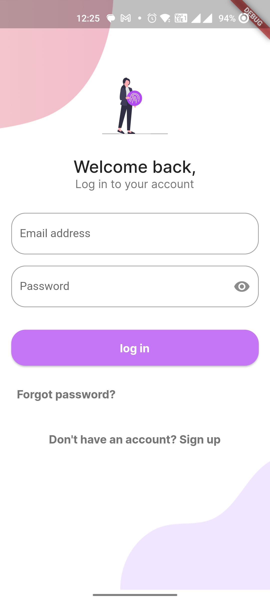
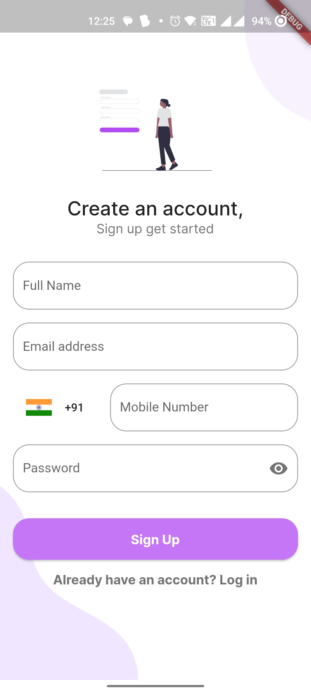
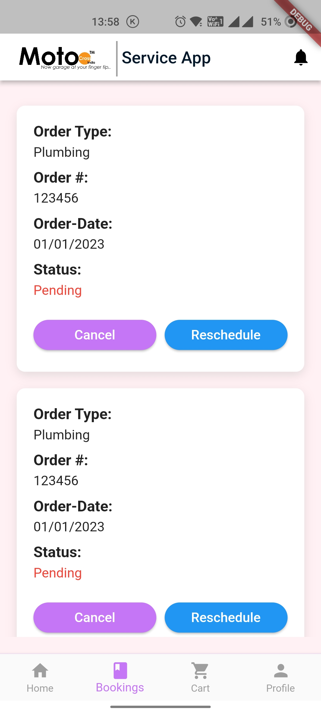
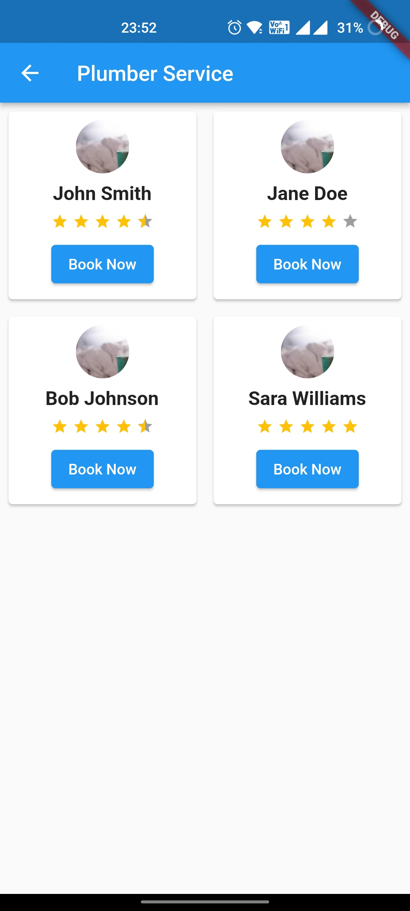
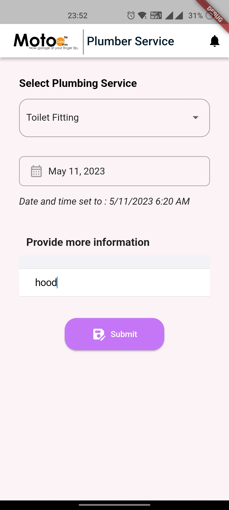
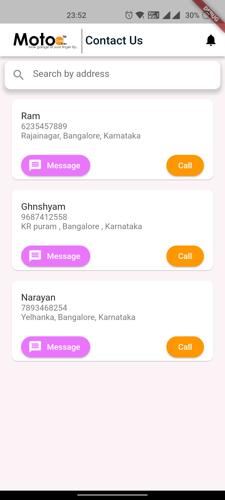

# Service app for motocross India

## Description

This is a Flutter app that is made for Motocross India.

## Requirements

- Flutter 2.8.1 or newer.
- Dart 2.15.1 or newer.

## Installation

1. Clone the repository: `git clone https://github.com/Churanta/ServiceApp-Motocross-India.git`
2. Open the project in Visual Studio Code
3. Install the dependencies: `flutter pub get`
4. Run the app: `flutter run`

## Usage

1. Launch the app
2. Run the Code
3. Enjoy using the app
4. Don't forget to give a star if you like it

## Screenshots

|              Login               |              SignUp              |            Verify OTP            |
| :------------------------------: | :------------------------------: | :------------------------------: |
|  |  |  |

|                                                                     UserPage                                                                     |             Booking              |           HomePage OTP           |
| :----------------------------------------------------------------------------------------------------------------------------------------------: | :------------------------------: | :------------------------------: |
|  |  |  |

| UserPage | Booking | Homepage |
| :------: | :-----: | :------: |

| |  |  |

|            RewardPage            |             Plumbers             |             formplum             |
| :------------------------------: | :------------------------------: | :------------------------------: |
|  |  |  |

|             Share app             |              Contact              |                                                                        Wallet                                                                        |
| :-------------------------------: | :-------------------------------: | :--------------------------------------------------------------------------------------------------------------------------------------------------: |
|  |  |  |

## Credits

This app was created by Churanta Mondal.

## License

This project is licensed under the MIT License - see the LICENSE.md file for details.
