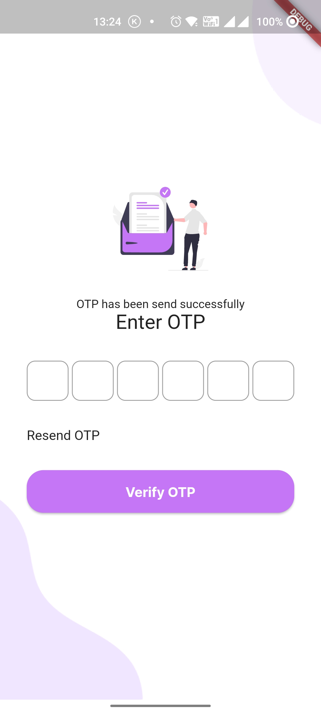

# Flutter App Readme

## Description

This is a Flutter app that is made for Motocross India.

## Requirements

- Flutter 2.8.1 or newer
- Dart 2.15.1 or newer

## Installation

1. Clone the repository: `git clone https://github.com/Churanta/ServiceApp-Motocross-India.git`
2. Open the project in Visual Studio Code
3. Install the dependencies: `flutter pub get`
4. Run the app: `flutter run`

## Usage

1. Launch the app
2. Run the Code
3. Enjoy using the app

## Screenshots

|              Login               |              SignUp              |            Verify OTP            |
| :------------------------------: | :------------------------------: | :------------------------------: |
|  |  |  |

## Credits

This app was created by Churanta Mondal.

## License

This project is licensed under the MIT License - see the LICENSE.md file for details.
# Flutter-Login-Signup-pages-UI
# Flutter-Login-Signup-pages-UI
